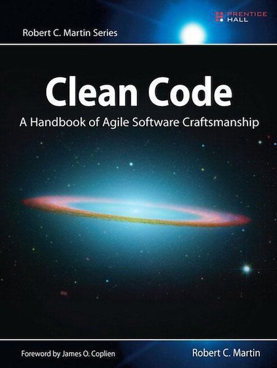
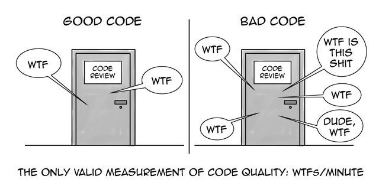
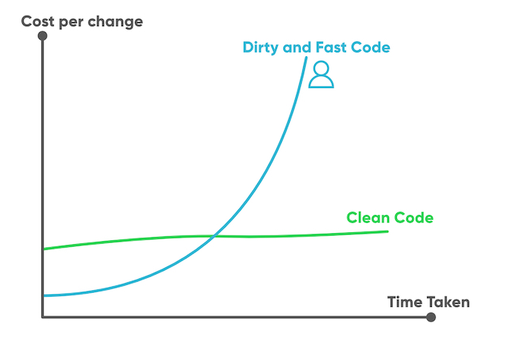
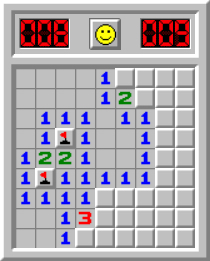

# Clean Code

## Tim Peeters

* Afgestudeerd in 2003, KDG Toegepaste Informatica (Applicatieontwikkeling)
* Al 18+ jaar werkzaam bij Xplore Group (Cronos)
* Devoxx Program & Steering Committee member
* Clean Code, Clean Architecture evangelist
* Twitter @peeterstim

***

## Clean Code



* First, you are a programmer
* Second, you want to be a better programmer

***

### Measurement of code quality



***

### Cost of Change



***

### Boy Scout Rule

* Leave the campground cleaner than you found it

***

## Meaningful Names

### Use Intention-Revealing Names

Bad:
```java
int d; // elapsed time in days 
```

Good:
```java
int elapsedTimeInDays;
```

***

### Use Intention-Revealing Names

```java
public List<int[]> getThem() {
    List<int[]> list1 = new ArrayList<int[]>();
    for (int[] x : theList) {
        if (x[0] == 4) {
            list1.add(x);
        }
    }
    return list1;
}
```

***

### Use Intention-Revealing Names

```java
public List<Cell> getFlaggedCells() {
    List<Cell> flaggedCells = new ArrayList<>(); 

    for (Cell cell : gameBoard) {
        if (cell.isFlagged()) {
            flaggedCells.add(cell);
        }
    }

    return flaggedCells; 
}
```



***

### Avoid Disinformation

```java
Set<Account> accountList;
```

***

### Make Meaningful Distinctions

Bad:
```java
public static void copyChars(char[] a1, char[] a2) {
    for (int i = 0; i < a1.length; i++) {
        a2[i] = a1[i];
    }
}
```

Good:
```java
public static void copyChars(char[] source, char[] destination) {
    for (int i = 0; i < source.length; i++) {
        destination[i] = source[i];
    }
}
```

***

### Use Pronouncable Names

Bad:
```java
class DtaRcrd102 {
    private Date genymdhms;
    private Date modymdhms;
    private final String pszqint = "102";
}
```

Good:
```java
class Customer {
    private Date generationTimestamp;
    private Date modificationTimestamp;
    private final String recordId = "102";
}
```

***

### Class Names

* Classes and objects should have noun or noun phrase names:
  * Account
  * Customer
  * AddressParser
* Avoid words like Manager, Processor, Data, Info (they don't add any meaning)
* A class name should not be a verb

***

### Method Names

* Methods should have verb or verb phrase names:
  * deletePage
  * save

### ...

***

## Functions

### Small

* Rule #1: Functions should be small
* Rule #2: They should be smaller than that

* Less than 10 lines

#### Do One Thing

* Functions should do one thing. 
They should do it well.
They should do it only.

See: `MethodLength.java`

***

### Use Descriptive Names

***

### Function Arguments

* The ideal number of arguments for a function is zero (niladic)
* Next comes one (monadic)
* Followed by two (dyadic)
* Three arguments (triadic)
* More than three (polyadic) requires very special justification

See: `FunctionArguments.java`

***

### Flag Arguments

* Passing a boolean into a function is a truly terrible practice

Bad:
```java
render(boolean isSuite)
```

### Don't Repeat Yourself

## Dependencies

* Find a balance between
  * Code re-use (don't re-invent the wheel)
  * High coupling due to too many dependencies
* Use tools to keep dependencies up-to-date
  * Dependabot (GitHub)
  * Renovatebot
